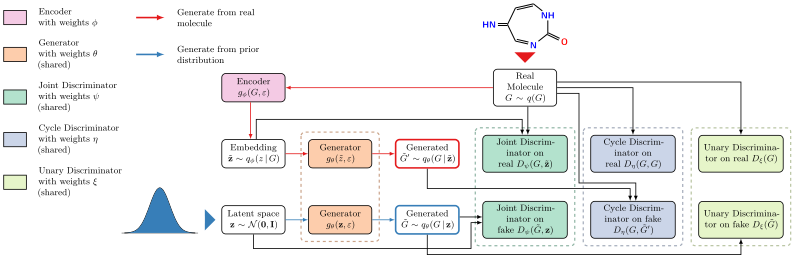

# Adversarial Learned Molecular Graph Inference and Generation

This is a TensorFlow implementation of [ALMGIG – Adversarial Learned Molecular Graph Inference and Generation](https://arxiv.org/abs/1905.10310).

Previous methods for molecular graph generation require solving an expensive graph isomorphism problem during training.
ALMGIG is a likelihood-free adversarial learning framework for inference and de novo molecule generation
that avoids explicitly computing a reconstruction loss.
Our approach extends generative adversarial networks by including an adversarial cycle-consistency loss
to implicitly enforce the reconstruction property.
To quantify the performance of models, we propose to compute the distance between distributions of
physicochemical properties with the 1-Wasserstein distance.



## Installation

### Docker (Linux only)

1. Install [Docker](https://docs.docker.com/install/) and [nvidia-docker](https://github.com/NVIDIA/nvidia-docker).
2. Build Docker image `almgig`:
```bash
cd dockerfiles/
./build-image.sh
```
3. **IMPORTANT:** Run all remaining scripts via the `run-docker.sh` script.
For instance, to run `python train_and_evaluate.py almgig --help`, run
```bash
./run-docker.sh python train_and_evaluate.py almgig --help
```

### Manually

1. Download and install [Miniconda](https://conda.io/en/latest/miniconda.html)
for Python 3.
2. Create a new conda environment `almgig` with all dependencies:
```bash
conda env create -n almgig --file dockerfiles/requirements.yaml
```

3. Activate the new environment:
```bash
conda activate almgig
```

4. Manually install GuacaMol without its dependencies:
```bash
pip install --no-deps 'guacamol==0.3.2'
```

5. Create fake fcd module which is imported by guacamol, but we don't use:
```bash
mkdir $(conda info --base)/envs/almgig/lib/python3.7/site-packages/fcd
touch $(conda info --base)/envs/almgig/lib/python3.7/site-packages/fcd/__init__.py
```

## Preparing the Data

The experiments in the paper use the [GDB-9 dataset](https://doi.org/10.1038/sdata.2014.22)
with at most 9 heavy atoms.
To download and preprocess the data, go to the `data` directory and
execute the `get-gdb9.sh` script:
```bash
cd data/
./get-gdb9.sh
```

This can take a while. If everything completed successfully, you should see

> All files have been created correctly.

Generated splits for training, validation, and testing will be stored in `data/gdb9/`.


## Training ALMGIG

To train ALMGIG with the same set of hyper-parameters as in the paper, run
```bash
./train_and_evaluate.sh
```

The script will save checkpoints in the `models/gdb9/almgig/` directory.
After training, several files will be generated for validation purposes:

1. Metrics comparing the distribution of 10 physicochemical properties
   of generated molecules and the training (test) data
   will be written to `outputs/descriptors/train/` (`outputs/descriptors/test/`).
2. Linear interpolation in latent space of 100 randomly selected pairs of molecules
   will be stored in `outputs/nearest_neighbors/`.
3. An interpolation along two dimension of the latent space will be written
   to `outputs/interpolation-test.svg`.
4. Statistics on invalid molecules will be written to `outputs/errors-table.tex`.

If you require more control over training and the architecture,
directly call the script `train_and_evaluate.py`.
To see a full list of available options, run
```bash
python train_and_evaluate.py almgig --help
```

To monitor generated molecules and their properties during training,
you can use [TensorBoard](https://www.tensorflow.org/tensorboard):
```bash
tensorboard --logdir models/gdb9/
```

## Training Baseline Models

We trained and validated several baseline models on the same set of molecules as ALMGIG.
Details are described in a [separate README](baselines/README.md).

## Evaluation

When performing training as above, statistics for each generated molecule will
be generated automatically, for other models, you can create a file with generated molecules
in SMILES representation (one per line), and execute the following script
to compute statistics:

```bash
python results/grammarVAE_asses_dist.py \
	--strict \
	--train_smiles data/gdb9/graphs/gdb9_train.smiles \
	-i "molecules-smiles.txt" \
	-o "outputs/other-model-distribution-learning.json"
```
This will generate `outputs/other-model-distribution-learning.json` containing
simple validation metrics (validity, uniqueness, novelty) as well as
`outputs/other-model-distribution-learning.csv` containing generated molecules.

To compute and compare physicochemical properties of generated molecules, run

```bash
python -m gan.plotting.compare_descriptors \
    --dist 'emd' \
    --train_file data/gdb9/graphs/gdb9_test.smiles \
    --predict_file \
    "models/gdb9/almgig/distribution-learning_model.ckpt-51500.csv" \
    "outputs/other-model-distribution-learning.csv" \
    --name "My Model" "Other Model" \
    --palette "stota" \
    -o "outputs/"
```

For each set of molecules following the `--predict_file` option, it
will generate a histogram showing the distribution of physicochemical properties
of generated molecules and the test data and their difference in terms of
1-Wasserstein (EMD) distance in the `outputs` directory.
Moreover, a plot comparing all models in terms
of mean negative exponential 1-Wasserstein distance (mEMD) will be available
at `outputs/comparison_dist_stota.pdf`.


## Cite

If you use our work, please cite us:
```
@inproceedings{Poelsterl2020-ALMGIG,
 author = {P{\"{o}}lsterl, Sebastian and Wachinger, Christian},
 title = {Adversarial Learned Molecular Graph Inference and Generation},
 booktitle = {ECML PKDD},
 year = {2020},
 eprint = {1905.10310},
 eprintclass = {cs.LG},
 eprinttype = {arXiv},
}
```

## Acknowledgements

This project contains modified code from the GuacaMol project, see
LICENSE.GUACAMOL for license information.
